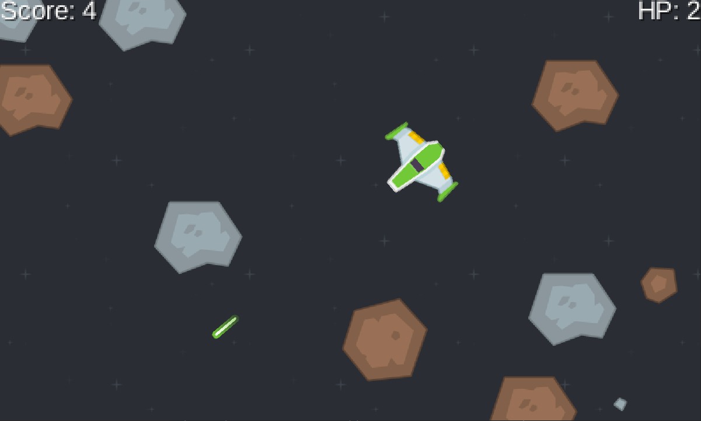

# Asteroids
Destroy asteroids with lasers and don't crash.

LibGDX desktop project.
### Prerequisites
Project is created with jdk-17.
### Installation
1. **Clone the Repository:**
   ```bash
   git clone https://github.com/HardCrabS/Asteroids-test-task.git
2. **Run the Project:**
   ```bash
   ./gradlew desktop:run
### Build .jar and run
   ```
   ./gradlew desktop:dist
```
   ```
   java -jar generated-file-name.jar
```


